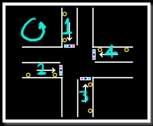

<div align="center"></div><hr>

<div align="center"><H1> Smart Traffic Light System (ASIC)</H1></div>
Design flow of an Application Specific Integrated Circuit (ASIC) that implements a smart traffic light system aiming to minimize wait time for all drivers while minimizing accident risk.

## Purpose

This is a university project for the ECE413s-ASIC Design and Automation course at Ain Shams university, this project aims to strengthen the student's design abilities as well as verification and troubleshooting skills.

The project goes through various phases till completion:
* [**System Design:**](#system-design)     Deciding system's main functionality and constraints, constituents modules and their interfacing, the thought process behind the decisions.
  
* [**Light Algorithm:**](#light-algorithm)    Flowchart and pseudocode for the designed algorithm for the traffic lights that allows for minimum accident risk and maximum traffic time utilization.

* **Controller Specs:**   Planning the architecture and logic of the traffic controller and how it interfaces with the traffic lights to give them orders.

* **FSM Design:**         Creating schematic and state table for the finalized state machine that enables our traffic lights using inputs from the controller.

* **Simulation:**         The Verilog code for the design with the synthesis schematic of the RTL code, as well as snapshots of the waveform diagrams.

* **Test Bench:**         The verification test written for the design to check correct functionality and provide the proposed test strategy to ensure all cases are tested.

## Disclaimer

It's important to note that this implementation may not follow all best practices and may not be the most efficient or optimal solution. As an educational project, We relied on our own creativity and problem-solving skills to overcome hurdles along the way. While the IC is functional and capable of doing its task, there is always room for improvement in terms of performance, efficiency, and design.

---

<div align="center"><H1>Design Flow</H1></div>

## System Design

<div align="center"></div>

- #### System Architecture: 
    -	The system consists of four traffic lights, each traffic light module consists of three light bulbs **(Green, Yellow, and Red)**, and two sensors **(1st and 5th row sensors)**.

    -	The system also includes a traffic controller which takes the readings of both sensors from each traffic light as an input as seen in Figure 1, using logic to be discussed later, the controller then generates an on/off 3-bit signal to each traffic lights, informing each traffic light to be in one of three states : 

<div align="center">
<table><th>Combination</th><th>State</th>
    <tr>
        <td>(001)</td> <td>Red</td>
    </tr>
    <tr>
        <td>(010)</td> <td>Yellow</td>
    </tr>
    <tr>
        <td>(100)</td> <td>Green</td>
    </tr>
</table>
</div>

<br>

- #### System Constraints:
    <div align="center"></div>
    <br>

    - The system needs to ensure 2 important constraints:
        -	Do not enable two or more traffic lights that would generate intersecting paths, to prevent car accidents.
        -	Traffic lights on time must be a function of its sensors to ensure fairness of traffic for all drivers.

    - As seen in Figure 2, this is the proposed layout of the intersection, since we do enforce a certain direction on the drivers after turning on the traffic light, then this leaves the drivers with 3 options:
        -	Forward
        -	Right
        -	Left

    - This means that if we enable more than two traffic lights at a time there will be crossing paths that could introduce car accidents, thus, to respect the 1st constraint **we deduce we cannot turn on more than one traffic light at the same time.** (New constraint extended from 1st)

    - As for the 2nd constraint we just need to consider the values of the sensor and build a light algorithm that will maximize fairness to drivers by using these values, discussed in next topic.

## Light Algorithm
Propsed light algorithm:


```c++
    
// Always loop on streets anti-clockwise starting f
    Start on 1st street
    while true {
        // If no traffic, don't turn on the lights and goto next street
        if 1st sensor Is False{
            Next street
        }
        // If congested then give extra time
        else if 5th sensor is True{
        Turn Traffic_Light Green and Add extra_time
        }
        // If there is traffic but not congested, start normal time
        else{
            Turn Traffic_Light Green
        }

        // Wait for Traffic_Light wait for Traffic_Light to end
        wait for Traffic_Light to end
        // Goto next street when done Next street
        Next street
 }
```
<div>
As we can see, the proposed algorithm iterates over all streets counterclockwise and checks if there is traffic to turn on the traffic light, if the street is congested, it gives it even extra traffic time.
This ensures that streets with no traffic gets no traffic time, and streets with high traffic get maximum traffic time, thus, this respects the 2nd constraint of our system which is to maximize fairness to all drivers by making the traffic time function of the sensor values.

</div>

## Contributing

Contributions to this project are welcome! If you find any issues, have suggestions for improvements, or would like to add new features, please feel free to open an issue or submit a pull request.

When contributing, please ensure that your code follows the existing coding style and conventions. Additionally, make sure to thoroughly test any changes or additions you make.

## License

This project is licensed under the MIT License. For more information, please refer to the [LICENSE](LICENSE) file.

## Acknowledgments
Special thanks to our course instructors, **Dr. Diaa Eldin Khalil** and **Eng. Alaa Salah** for their guidance and support, as well as a special thanks to the Verilog community, for their valuable resources and support.


## ✨ Team Members ✨

<div align="center">
<table style="margin-left: auto; margin-right: auto;">
<tr>
    <td align="center"><a href="https://github.com/DopeBiscuit"><br /><sub>DopeBiscuit</sub></a></td>
    <td align="center"><a href="https://github.com/AyaTarekS"><br /><sub>AyaTarekS</sub></a></td>
    <td align="center"><a href="https://github.com/RanaAyman54"><br /><sub>RanaAyman54</sub></a></td>
    <td align="center"><a href="https://github.com/Abdelrahman1810"><br /><sub>Abdelrahman M.Ali</sub></a></td>
</tr>
