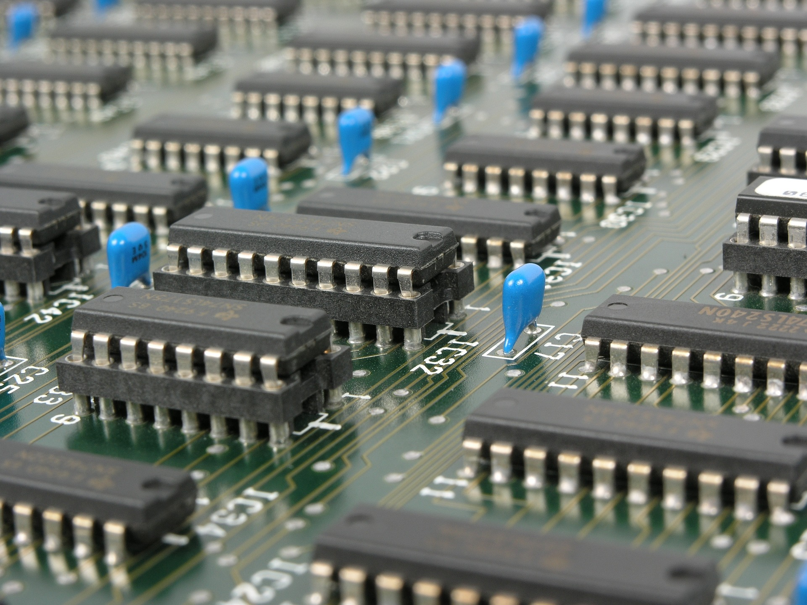

# Smart Traffic Light System (ASIC)
Design flow of an Application Specif Integrated Circuit (ASIC) that implements a smart traffic light system aiming to minimize wait time for all drivers while minimizing accident risk.

## Purpose

This is a university project for the ECE413s-ASIC Design and Automation course at Ain Shams university, this project aims to strengthen the student's design abilities as well as verification and troubleshooting skills.

The project goes through various phases till completion:
* *System Design:*      Deciding system's main functionality and constraints, constituents modules and their interfacing, the thought process behind the decisions.
* *Light Algorithm:*    Flowchart and pseudocode for the designed algorithm for the traffic lights that allows for minimum accident risk and maximum traffic time utilization.
* *Controller Specs:*   Planning the architecture and logic of the traffic controller and how it interfaces with the traffic lights to give them orders.
* *FSM Design:*         Creating schematic and state table for the finalized state machine that enables our traffic lights using inputs from the controller.